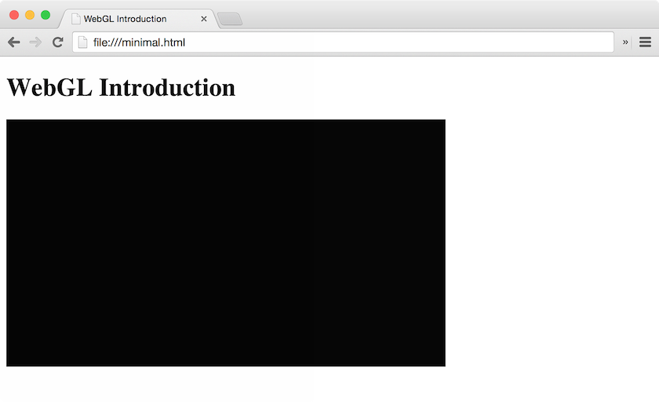

// TODO: What is WebGL

In order to get started we first of all need to create an HTML document which will later contain our WebGL context.

<div class="alert alert-info" role=alert>
	This lesson uses the latest HTML5 standard, which might look strange if you are used to HTML4.<br>
	Make sure to get up to date with HTML5 first.
	(E.g. with the
	<a
	href=https://developer.mozilla.org/en-US/docs/Web/Guide/HTML/HTML5>
		Mozilla HTML5 guide
	</a>)
</div>

Create a file called `index.html` and paste following code:


```html
{{code/minimal.html}}
```


You can now open the file with your favorite browser and then you should see something like this:



Congratulations! \
You just created your first WebGL rendering!

Yeah, I know, it's just a black square, but hey … all beginnings are difficult. 😉

So, what exactly happens here:

First of all we create a canvas where we can later draw out graphics onto.
As the default size of 300px × 150px is a little small, so we set a larger size using the HTML height and width properties.
We also assign an id to the canvas element to be able to reference it easily in our JavaScript later on.

Now we can specify the JavaScript code which draws the graphics on the canvas.
Therefore we need to get a reference to the canvas element and the accompanying WebGL context.

The `clearColor()` method specifies the red, green, blue, and alpha values to clear the color buffers.
The `clear()` method then clears the color buffer to the preset value.


// TODO: Exercises
